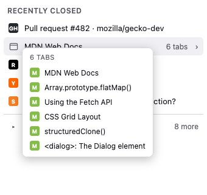
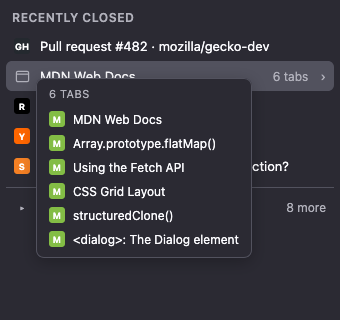

# Recently Closed


A Firefox extension that merges **Recently Closed Tabs** and **Recently Closed
Windows** into a single, time-ordered list in a toolbar popup.

> **Install:** [Get it on addons.mozilla.org](https://addons.mozilla.org/en-US/firefox/addon/recently-closed-shortcut/) — *pending review; the link goes live once approved.*

The popup, showing a merged list of closed tabs and windows with a hover
tooltip listing a closed window's tabs and a "See all" toggle (light and dark
themes):




- The **5 most recent** closed items are shown inline.
- Windows show how many tabs they contained (e.g. `5 tabs`).
- **Hovering a closed window** shows a floating tooltip, anchored just below
  the row, listing every tab name in that window. It floats over the list and
  never resizes the popup, so the list stays a single narrow column and never
  shifts under the cursor.
- Everything older is hidden behind a **See all** toggle.
- Clicking any item restores it.

## Why a toolbar popup and not the native menu?

Firefox's native **History** menu (the macOS menu bar) and the **hamburger
menu** are browser *chrome* — no WebExtension API can modify them. Altering
them requires a privileged `autoconfig`/`userChrome.js` script installed inside
the Firefox application bundle, which is not distributable on
addons.mozilla.org and breaks across updates. This extension instead provides
the same merged behavior in a standard, distributable toolbar popup, backed by
the same data source (`browser.sessions.getRecentlyClosed()`).

## Install (temporary, for development)

1. Open `about:debugging#/runtime/this-firefox`.
2. Click **Load Temporary Add-on…**.
3. Select `manifest.json` in this folder.
4. The toolbar button appears; click it to open the list.

Temporary add-ons are removed when Firefox restarts. To package for signing:

```sh
npm i -g web-ext
web-ext lint
web-ext build
```

## Files

| File | Purpose |
|------|---------|
| `manifest.json` | Extension manifest (MV3). Requests `sessions` + `tabs`. |
| `popup/popup.html` | Popup markup. |
| `popup/popup.css` | Styling (light/dark aware). |
| `popup/popup.js` | Fetches and renders the merged recently-closed list. |
| `icons/icon.svg` | Toolbar / add-on icon (theme-aware, used at runtime). |
| `store/icon-128.png` | 128×128 listing icon for the addons.mozilla.org submission. |
| `store/screenshot.png` | Popup screenshot (light theme) for the addons.mozilla.org listing. |
| `store/screenshot-dark.png` | Popup screenshot (dark theme) for the addons.mozilla.org listing. |

## Permissions

- `sessions` — read and restore recently closed tabs/windows.
- `tabs` — read tab titles/favicons of closed sessions for display.
